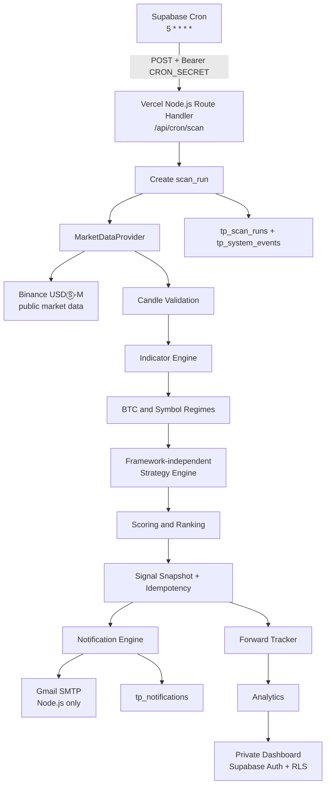

# TradePulse Architecture

Status: M3-D.1 intrabar settlement-resolution implementation (Draft PR)
Runtime baseline: Node.js 22+
Deployment baseline: Next.js App Router on Vercel

## System boundary



## Responsibility split

### Next.js / Vercel

- Serves the App Router UI and private dashboard routes.
- Hosts finite-lifetime Node.js Route Handlers and Vercel Functions.
- Owns server-side orchestration, public health reporting, and the future protected scan entry point.
- Sends Gmail SMTP from Node.js only; no SMTP dependency is placed in the browser or Edge Runtime.
- Does not run a permanent worker, infinite loop, or real-trading worker.

### Supabase

- Provides PostgreSQL, Auth, RLS, Cron, and persistent operational records.
- Calls the future Vercel scan endpoint once per hour, approximately five minutes after the hourly 1H candle close (`5 * * * *`).
- Stores strategy versions, signals, scores, results, decisions, notifications, scan runs, events, and future backtest records.
- Does not contain the core strategy in triggers or PL/pgSQL. Strategy logic remains in TypeScript.

### Binance

- Is an interchangeable public market-data adapter implemented in M1.
- The Strategy Engine receives normalized candles and context, never Binance URLs or SDK details.
- No private endpoint, account endpoint, API key, order endpoint, or withdrawal capability is part of the current architecture.

### Gmail

- Is a notification transport only.
- The later implementation uses `smtp.gmail.com`, port `587`, STARTTLS, and a Google App Password.
- SMTP credentials are read only by a server function and delivery state is persisted in `tp_notifications`.

## Code boundaries

```text
src/
  app/                 App Router pages and Route Handlers
  lib/
    market-data/       Provider interface, Binance REST adapter, parser, and validation
    historical-data/   Historical Binance pagination, validation, manifests, and checksums
    backtest/          As-of windows, settlement, metrics, acceptance, reports, and runner
    analytics/         Future performance queries and metric definitions
    config/            Centralized, audited application configuration
    indicators/        Pure EMA/RSI/ATR calculations
    market-data/       MarketDataProvider and Binance adapter boundary
    notifications/     Future email policy, template, and delivery adapter
    scoring/           Future component score and grade calculation
    security/          Auth, cron, and secret-handling helpers
    signals/           Future snapshot, idempotency, and lifecycle services
    strategy/          Single Source of Truth for baseline-001 rules
    supabase/          Browser and server SSR client boundaries
    types/             Shared domain types
scripts/backtest-run.ts M3-B local historical report CLI; generated output is ignored
supabase/migrations/   Versioned SQL schema; never Dashboard-only changes
tests/                 Unit and integration tests
docs/                  Product, architecture, strategy, security, and test design
```

M1 adds the public market-data layer under `src/lib/market-data/`. M3-B adds
historical retrieval under `src/lib/historical-data/` and deterministic
signal-level research under `src/lib/backtest/`; it does not add candle
persistence, Supabase writes, notifications, scanning, or trading capability.

## M1 market-data flow

1. `BinanceMarketDataProvider` requests Binance server time from `/fapi/v1/time`.
2. It validates the five approved symbols against `/fapi/v1/exchangeInfo`.
3. It requests 251 recent 1h/4h Kline rows through `BinancePublicClient` with bounded timeout, retry, and concurrency.
4. The Binance parser converts the twelve-field array into the provider-independent `Candle` model.
5. Validation rejects malformed, out-of-order, duplicate, gapped, forming, insufficient, or stale data.
6. The provider returns `VALID`, `PARTIAL`, or `INVALID` per-symbol results in an immutable-oriented `MarketSnapshot`.

The M2-B Strategy Engine consumes only normalized closed candles and pure
domain values. It never imports Binance URLs, raw Kline arrays, HTTP clients,
Vercel, Supabase, SMTP, React, or database modules.

## M2-B pure domain flow

1. Receive the five approved symbols with normalized, fully closed 1H and 4H
   candle arrays plus an explicit historical `evaluationTime`.
2. Reject any supplied candle with `closeTime > evaluationTime` before it can
   affect indicators, regimes, BTC gating, or scoring.
3. Calculate EMA20/50/200, RSI14, and ATR14 with explicit pre-warm-up
   unavailable values.
4. Calculate the latest symbol 4H regime and the BTCUSDT 4H regime.
5. Apply BTC directional gating and the frozen 1H pullback, breakout, RSI,
   volume, and stop guard rules.
6. Calculate the five score components, total score, grade, formal eligibility,
   and deterministic research-universe ranking.

The same `evaluateStrategy` function is reusable by future realtime and
backtest adapters. M2-B performs no persistence, network access, scheduling,
notification, or outcome resolution.

## M3-B historical backtest flow

1. `BinanceHistoricalDataLoader` calls only the public USDⓈ-M Futures Kline
   and funding-rate endpoints through the existing bounded Binance client.
   It captures authoritative Binance server time once per study load and
   rejects every candle whose close is not strictly before that time.
2. The loader paginates explicit ranges, validates chronological/aligned
   candles and funding records, requires the official funding `markPrice` for
   the current `bt-policy-001` implementation, and records canonical SHA-256
   manifests. No sort, gap fill, synthetic row, private API, or alternate
   provider is allowed. `bt-policy-002` additionally loads official historical
   mark-price Klines only when an invalid direct funding mark requires the
   frozen fallback.
3. The range builder separates the 55/205 indicator minimums from the 250
   strategy window and requests 250-candle 1H/4H historical lookback. The
   backtest clock enumerates fully closed 1H signal points inside DEV or OOS.
   Historical series are prevalidated and indexed once; each point uses binary
   lookup and an exact 250-candle slice as-of `evaluationTime = C_t.closeTime`.
4. The adapter calls the existing `evaluateStrategy(...)` once per evaluation
   and retains every returned evaluation. Only formal candidates with
   `totalScore >= 70` enter the settlement adapter selected by the explicit
   backtest policy; the strategy candidate and references are unchanged.
5. Settlement uses exactly 24 held 1H candles total: the next-open entry is
   held #1 and the close of held #24 is TIME_EXIT. DEV crossing is
   `PERIOD_END_CENSORED`; OOS post-end rows are settlement-only and never
   generate evaluations.
6. The runner requires provider- and checksum-bearing manifests for every
   approved symbol's base 1H/4H/funding data and, for OOS/COMBINED, the
   settlement-only 1H/funding tails. Missing coverage is `INCOMPLETE` and can
   never produce a formal PASS. It computes signal-level R/fee/funding
   metrics, deterministic ordering/drawdown/overlap/concentration, separate
   DEV/OOS/COMBINED metrics, and an overall acceptance decision. It writes
   only ignored local output through the CLI; it does not persist to Supabase
   or send notifications.

### M3-B.1 funding compatibility boundary

`bt-policy-001` remains the immutable M3-B funding contract: a missing or
invalid funding-history `markPrice` is `DATA_INCOMPLETE`. The implemented
`bt-policy-002` contract adds one historical compatibility source, and only
after the direct funding-history value fails validation: the official
USDⓈ-M Futures `/fapi/v1/markPriceKlines` endpoint at `1h`, selecting the
greatest fully closed candle with `closeTime < fundingTime`. Its close is the
fallback mark price and its provenance is
`MARK_PRICE_KLINE_PRE_EVENT_CLOSE`; a direct value is recorded as
`FUNDING_RATE_HISTORY`.

The fallback cannot use ordinary trading candles, spot/index/premium-index
prices, interpolation, future candles, current mark price, entry price, zero,
or third-party data. No funding event may be dropped; missing fallback data
remains `DATA_INCOMPLETE`. Every charge, fallback count, UTC-year/symbol
breakdown, and fallback manifest hash must be auditable. This boundary changes
no strategy rule or funding economics and has no observed performance result.

The frozen `bt-policy-002` mark-price ranges are derived only from the funding
ranges:

```text
markPriceRange.startTime = fundingRange.startTime - 1 hour
markPriceRange.endTime   = fundingRange.endTime
```

For an OOS or COMBINED settlement tail:

```text
settlementTail.markPriceRange.startTime = settlementTail.startTime
settlementTail.markPriceRange.endTime   = settlementTail.fundingRange.endTime
settlementOnly = true
```

The base lead-in is required so the earliest funding event can use its
pre-event support candle. These ranges are never derived from observed
performance or trade results.

Mark-price Klines use the same authoritative study `serverTime` as all other
historical data and accept only `closeTime < serverTime`. The future loader
contract requires strict chronological order, exact 1H continuity, no
duplicates, valid timestamps, finite positive OHLC, and valid OHLC
relationships. Sorting, gap filling, interpolation, and synthetic candles
are prohibited; any required invalid or missing data is `DATA_INCOMPLETE`.

Formal manifest coverage is usage-driven. A fallback charge must have a valid
official 1H mark-price manifest for its symbol and the exact frozen base or
settlement-tail range; a tail fallback must also use `settlementOnly = true`.
Missing, wrong-source, wrong-range, wrong-settlement, or invalid-checksum
coverage makes the formal result `INCOMPLETE`. Direct-only `bt-policy-002`
segments do not require an unused fallback manifest. Loaded mark-price candles
retain explicit base versus settlement-tail provenance. A tail fallback that
uses the final base support candle therefore requires the base manifest, while
a fallback using a closed tail candle requires the settlement-only manifest.
Provided mark-price manifests are always checked for provider, source,
timeframe, symbol, and SHA-256 integrity, even when not required by a charge.

Policy selection and report schema are explicit. `bt-policy-001` serializes as
`m3-b-report-001`; `bt-policy-002` serializes as `m3-b-report-002`, which
contains the provenance/fallback audit fields; and `bt-policy-003` serializes as
the current `m3-b-report-004`, with the exact study clock in
`studyServerTime`. The historical M3-E output remains frozen as
`m3-b-report-003`. A formal run must supply `--policy`; missing or
unknown policy fails closed. The prior M3-C replacement command was:

```text
npm run backtest:run -- --period COMBINED --policy bt-policy-002
```

The new policy's formal command is:

```text
npm run backtest:run -- --period COMBINED --policy bt-policy-003
```

The implementation requires explicit policy selection for formal CLI runs.
The implementation is usage-driven and does not rerun M3-C or overwrite the
`bt-policy-002` evidence.

### M3-D intrabar settlement-resolution boundary

`bt-policy-003` inherits all `bt-policy-002` behavior except the frozen
intrabar settlement resolution below. `baseline-001`, `bt-policy-001`,
`bt-policy-002`, all strategy thresholds, entry/stop/TP references, 5bps
slippage and fees, funding economics, 24 held candles, TIME_EXIT, and all
acceptance thresholds remain unchanged.

Only official Binance USDⓈ-M Futures `/fapi/v1/klines` at `interval = 1m` may
be used. These Klines are settlement-only and never enter `StrategyInput`.
The loader is usage-driven: it loads only a 1H exit hour that would be
`SETTLEMENT_AMBIGUOUS` under `bt-policy-002`, deduplicated by
`symbol + exitCandle.openTime`, requesting exactly the 60 minutes from the
exit candle open through close. It must not load the full period at 1m.

The 1m loader uses the same study `serverTime` and requires
`closeTime < serverTime`, exactly 60 continuous rows, strict chronological
order, unique open times, valid timestamps, finite positive OHLC, and valid
OHLC relationships. Sorting, gap filling, interpolation, synthetic candles,
and assumed paths are forbidden; required invalid or missing data is
`DATA_INCOMPLETE`.

The `bt-policy-002` 1H settlement remains authoritative. Before using 1m data,
freeze `frozenExitReason = TP | SL`; if the 1H candle touched both brackets,
the existing 1H conservative rule freezes `SL`. The 1m rows resolve time only:
for frozen SL, LONG matches `low <= stop` and SHORT matches `high >= stop`; for
frozen TP, LONG matches `high >= TP` and SHORT matches `low <= TP`. Walk the
rows chronologically and select the first minute reproducing the frozen reason.
The opposite bracket cannot change or substitute for that reason. A minute
touching both brackets satisfies the already-frozen reason; it does not create a
new 1m SL-first rule. If the frozen reason is not reproduced, the result is
`DATA_INCOMPLETE`.

Before resolution, the 60 1m rows must reconcile exactly with their official 1H
exit candle: first open equals 1H open, last close equals 1H close, maximum
high equals 1H high, and minimum low equals 1H low. No epsilon, sorting, fill,
interpolation, or inferred path is permitted; any mismatch is
`DATA_INCOMPLETE`.

Funding ordering remains `entryTime < fundingTime`. For TP/SL exits, funding
before `exitMinute.openTime` is included, funding after `exitMinute.closeTime`
is excluded, and funding exactly at the minute open is included. When
`exitMinute.openTime < fundingTime <= exitMinute.closeTime`, use the unchanged
funding PnL signs and the conservative rule: include a negative funding PnL,
exclude a positive funding PnL, and record zero deterministically when zero.
The provenance is `CONSERVATIVE_SAME_MINUTE`; this is not selected from
performance. TIME_EXIT retains `entryTime < fundingTime <= exitTime` and needs
no 1m data.

Funding ordering is audited separately from applied funding charges. Every
considered event records `fundingTime`, `theoreticalFundingPnL`, `included`,
its resolution (`ONE_HOUR_UNAMBIGUOUS`, `ONE_MINUTE_RESOLVED`, or
`CONSERVATIVE_SAME_MINUTE`), and applicable exit-minute open/close times. A
positive same-minute funding credit is still audited with `included = false`
even though it need not appear as an applied `fundingCharge`.

Allowed settlement provenance includes `ONE_HOUR_UNAMBIGUOUS`,
`ONE_MINUTE_RESOLVED`, and `CONSERVATIVE_SAME_MINUTE`. Every former ambiguity
must resolve deterministically or become `DATA_INCOMPLETE`; a complete study
requires zero remaining `SETTLEMENT_AMBIGUOUS`, otherwise the result is
`INCOMPLETE`.

Each required minute window has a `kind = intrabar-settlement` manifest from
`binance-usdm-public` `/fapi/v1/klines`, `timeframe = 1m`, matching symbol,
requested and actual boundaries, `rowCount = 60`, retrieval time, SHA-256, and
correct `settlementOnly` classification. Missing or invalid required manifests
are `INCOMPLETE`; unused manifests are optional. `m3-b-report-003` exposes
reconciled `intrabarSettlementWindowsLoaded`,
`intrabarResolvedFundingOrderCount`, `conservativeSameMinuteCount`, and
`remainingSettlementAmbiguousCount`, broken down by symbol and UTC year.
The first count is unique loaded `symbol + exitCandle.openTime` windows; the
second counts audit records resolved with 1m chronology; the third counts all
`CONSERVATIVE_SAME_MINUTE` audit records, included or excluded; and the fourth
counts unresolved `SETTLEMENT_AMBIGUOUS` results. These counts must reconcile
with the funding-order audit records.

The existing precedence remains `INCOMPLETE > INSUFFICIENT_SAMPLE > FAIL >
PASS`, and the prior `bt-policy-002` Formal Run #1 remains a separate immutable
evidence record.

## Realtime scan lifecycle

The future M4 request is finite and ordered:

1. Verify `Authorization: Bearer <CRON_SECRET>` before doing work.
2. Create a `tp_scan_runs` row with a unique scheduled run identity.
3. Request public candles for the five approved symbols and required 1H/4H history.
4. Reject missing, stale, out-of-order, malformed, or incomplete data; record `DATA_ERROR` or `SCAN_FAILED` and create no formal signal.
5. Calculate indicators and regimes in pure domain code.
6. Call the one Strategy Engine for each symbol.
7. Calculate score, grade, rank, and reference values.
8. Insert the immutable signal using the database uniqueness constraint.
9. Create notification records and await bounded SMTP delivery in the same function lifetime.
10. Persist scan outcome, notification outcome, and system events before returning the response.

No step may rely on work continuing after the function returns.

## Single Source of Truth

The Strategy Engine accepts normalized candles, indicators, and market context and returns deterministic candidates. It imports no Vercel, Supabase, Gmail, HTTP, React, or database module.

```text
Strategy Engine
├── Realtime Scanner adapter
└── Backtest Runner adapter
```

The two adapters may differ in data loading and persistence, but not in signal conditions, score inputs, reference formulas, or lifecycle semantics.

## Authentication flow

- Authenticated browser sessions use Supabase Auth cookies through `@supabase/ssr`.
- Server-rendered protected pages use a server Supabase client and validate claims according to current Supabase guidance.
- A Next.js Proxy will be added when the private dashboard is implemented; M0 does not expose a dashboard route.
- Data access is additionally enforced by Postgres RLS. Authenticated access alone is not an ownership policy.
- A cron request is machine-authenticated separately with `CRON_SECRET`; it is not treated as a browser session.

## Environment separation

| Environment | Database | Notifications | Secrets |
| --- | --- | --- | --- |
| Local | Explicitly selected development project or none | Safe mode by default | `.env.local`, never committed |
| Preview | Separate/approved development or preview project | Safe mode; no production recipient by default | Vercel Preview variables |
| Production | Explicit production project | Enabled only after smoke test and review | Vercel Production variables |

An environment name is never inferred to mean a production database. Remote migrations require an explicitly identified development or production target and a separate review.

## Failure and observability

The system follows **No Data > Bad Signal**. Every future scan must make it possible to answer whether Cron ran, the endpoint authenticated, data arrived, data was rejected, a candidate existed, a score was filtered, a signal was persisted, and an email was sent. `tp_scan_runs`, `tp_system_events`, `tp_signals`, and `tp_notifications` form the durable audit trail; Vercel runtime logs and Supabase Cron history provide transport-level evidence.

## M1, M2-B, and M3-B non-goals

No formal scanner endpoint, candle persistence, Cron, notifications, SMTP send,
dashboard auth page, production Supabase application, WebSocket stream,
optimization, parameter tuning, M3-C historical acceptance study, or trading
capability is created in M1, M2-B, or M3-B.
