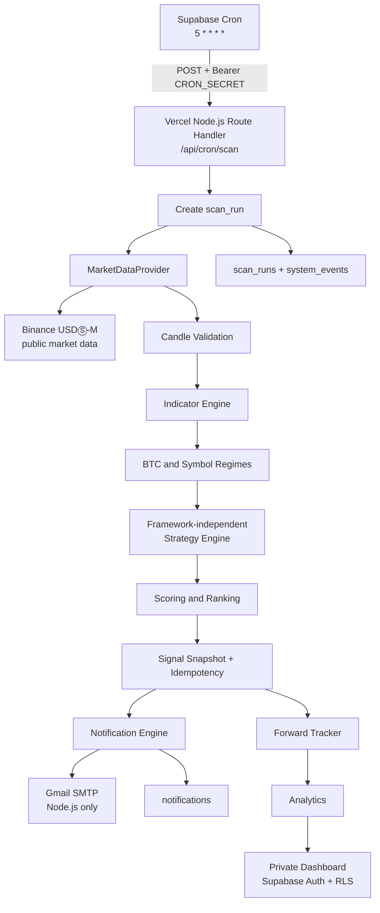

# TradePulse Architecture

Status: M3-B historical loader and deterministic backtest runner (Draft PR)
Runtime baseline: Node.js 22+
Deployment baseline: Next.js App Router on Vercel

## System boundary



## Responsibility split

### Next.js / Vercel

- Serves the App Router UI and private dashboard routes.
- Hosts finite-lifetime Node.js Route Handlers and Vercel Functions.
- Owns server-side orchestration, public health reporting, and the future protected scan entry point.
- Sends Gmail SMTP from Node.js only; no SMTP dependency is placed in the browser or Edge Runtime.
- Does not run a permanent worker, infinite loop, or real-trading worker.

### Supabase

- Provides PostgreSQL, Auth, RLS, Cron, and persistent operational records.
- Calls the future Vercel scan endpoint once per hour, approximately five minutes after the hourly 1H candle close (`5 * * * *`).
- Stores strategy versions, signals, scores, results, decisions, notifications, scan runs, events, and future backtest records.
- Does not contain the core strategy in triggers or PL/pgSQL. Strategy logic remains in TypeScript.

### Binance

- Is an interchangeable public market-data adapter implemented in M1.
- The Strategy Engine receives normalized candles and context, never Binance URLs or SDK details.
- No private endpoint, account endpoint, API key, order endpoint, or withdrawal capability is part of the current architecture.

### Gmail

- Is a notification transport only.
- The later implementation uses `smtp.gmail.com`, port `587`, STARTTLS, and a Google App Password.
- SMTP credentials are read only by a server function and delivery state is persisted in `notifications`.

## Code boundaries

```text
src/
  app/                 App Router pages and Route Handlers
  lib/
    market-data/       Provider interface, Binance REST adapter, parser, and validation
    historical-data/   Historical Binance pagination, validation, manifests, and checksums
    backtest/          As-of windows, settlement, metrics, acceptance, reports, and runner
    analytics/         Future performance queries and metric definitions
    config/            Centralized, audited application configuration
    indicators/        Pure EMA/RSI/ATR calculations
    market-data/       MarketDataProvider and Binance adapter boundary
    notifications/     Future email policy, template, and delivery adapter
    scoring/           Future component score and grade calculation
    security/          Auth, cron, and secret-handling helpers
    signals/           Future snapshot, idempotency, and lifecycle services
    strategy/          Single Source of Truth for baseline-001 rules
    supabase/          Browser and server SSR client boundaries
    types/             Shared domain types
scripts/backtest-run.ts M3-B local historical report CLI; generated output is ignored
supabase/migrations/   Versioned SQL schema; never Dashboard-only changes
tests/                 Unit and integration tests
docs/                  Product, architecture, strategy, security, and test design
```

M1 adds the public market-data layer under `src/lib/market-data/`. M3-B adds
historical retrieval under `src/lib/historical-data/` and deterministic
signal-level research under `src/lib/backtest/`; it does not add candle
persistence, Supabase writes, notifications, scanning, or trading capability.

## M1 market-data flow

1. `BinanceMarketDataProvider` requests Binance server time from `/fapi/v1/time`.
2. It validates the five approved symbols against `/fapi/v1/exchangeInfo`.
3. It requests 251 recent 1h/4h Kline rows through `BinancePublicClient` with bounded timeout, retry, and concurrency.
4. The Binance parser converts the twelve-field array into the provider-independent `Candle` model.
5. Validation rejects malformed, out-of-order, duplicate, gapped, forming, insufficient, or stale data.
6. The provider returns `VALID`, `PARTIAL`, or `INVALID` per-symbol results in an immutable-oriented `MarketSnapshot`.

The M2-B Strategy Engine consumes only normalized closed candles and pure
domain values. It never imports Binance URLs, raw Kline arrays, HTTP clients,
Vercel, Supabase, SMTP, React, or database modules.

## M2-B pure domain flow

1. Receive the five approved symbols with normalized, fully closed 1H and 4H
   candle arrays plus an explicit historical `evaluationTime`.
2. Reject any supplied candle with `closeTime > evaluationTime` before it can
   affect indicators, regimes, BTC gating, or scoring.
3. Calculate EMA20/50/200, RSI14, and ATR14 with explicit pre-warm-up
   unavailable values.
4. Calculate the latest symbol 4H regime and the BTCUSDT 4H regime.
5. Apply BTC directional gating and the frozen 1H pullback, breakout, RSI,
   volume, and stop guard rules.
6. Calculate the five score components, total score, grade, formal eligibility,
   and deterministic research-universe ranking.

The same `evaluateStrategy` function is reusable by future realtime and
backtest adapters. M2-B performs no persistence, network access, scheduling,
notification, or outcome resolution.

## M3-B historical backtest flow

1. `BinanceHistoricalDataLoader` calls only the public USDⓈ-M Futures Kline
   and funding-rate endpoints through the existing bounded Binance client.
   It captures authoritative Binance server time once per study load and
   rejects every candle whose close is not strictly before that time.
2. The loader paginates explicit ranges, validates chronological/aligned
   candles and funding records, requires the official funding `markPrice`, and
   records canonical SHA-256 manifests. No sort, gap fill, synthetic row,
   private API, or alternate provider is allowed.
3. The range builder separates the 55/205 indicator minimums from the 250
   strategy window and requests 250-candle 1H/4H historical lookback. The
   backtest clock enumerates fully closed 1H signal points inside DEV or OOS.
   Historical series are prevalidated and indexed once; each point uses binary
   lookup and an exact 250-candle slice as-of `evaluationTime = C_t.closeTime`.
4. The adapter calls the existing `evaluateStrategy(...)` once per evaluation
   and retains every returned evaluation. Only formal candidates with
   `totalScore >= 70` enter the frozen `bt-policy-001` settlement adapter.
5. Settlement uses exactly 24 held 1H candles total: the next-open entry is
   held #1 and the close of held #24 is TIME_EXIT. DEV crossing is
   `PERIOD_END_CENSORED`; OOS post-end rows are settlement-only and never
   generate evaluations.
6. The runner requires provider- and checksum-bearing manifests for every
   approved symbol's base 1H/4H/funding data and, for OOS/COMBINED, the
   settlement-only 1H/funding tails. Missing coverage is `INCOMPLETE` and can
   never produce a formal PASS. It computes signal-level R/fee/funding
   metrics, deterministic ordering/drawdown/overlap/concentration, separate
   DEV/OOS/COMBINED metrics, and an overall acceptance decision. It writes
   only ignored local output through the CLI; it does not persist to Supabase
   or send notifications.

## Realtime scan lifecycle

The future M4 request is finite and ordered:

1. Verify `Authorization: Bearer <CRON_SECRET>` before doing work.
2. Create a `scan_runs` row with a unique scheduled run identity.
3. Request public candles for the five approved symbols and required 1H/4H history.
4. Reject missing, stale, out-of-order, malformed, or incomplete data; record `DATA_ERROR` or `SCAN_FAILED` and create no formal signal.
5. Calculate indicators and regimes in pure domain code.
6. Call the one Strategy Engine for each symbol.
7. Calculate score, grade, rank, and reference values.
8. Insert the immutable signal using the database uniqueness constraint.
9. Create notification records and await bounded SMTP delivery in the same function lifetime.
10. Persist scan outcome, notification outcome, and system events before returning the response.

No step may rely on work continuing after the function returns.

## Single Source of Truth

The Strategy Engine accepts normalized candles, indicators, and market context and returns deterministic candidates. It imports no Vercel, Supabase, Gmail, HTTP, React, or database module.

```text
Strategy Engine
├── Realtime Scanner adapter
└── Backtest Runner adapter
```

The two adapters may differ in data loading and persistence, but not in signal conditions, score inputs, reference formulas, or lifecycle semantics.

## Authentication flow

- Authenticated browser sessions use Supabase Auth cookies through `@supabase/ssr`.
- Server-rendered protected pages use a server Supabase client and validate claims according to current Supabase guidance.
- A Next.js Proxy will be added when the private dashboard is implemented; M0 does not expose a dashboard route.
- Data access is additionally enforced by Postgres RLS. Authenticated access alone is not an ownership policy.
- A cron request is machine-authenticated separately with `CRON_SECRET`; it is not treated as a browser session.

## Environment separation

| Environment | Database | Notifications | Secrets |
| --- | --- | --- | --- |
| Local | Explicitly selected development project or none | Safe mode by default | `.env.local`, never committed |
| Preview | Separate/approved development or preview project | Safe mode; no production recipient by default | Vercel Preview variables |
| Production | Explicit production project | Enabled only after smoke test and review | Vercel Production variables |

An environment name is never inferred to mean a production database. Remote migrations require an explicitly identified development or production target and a separate review.

## Failure and observability

The system follows **No Data > Bad Signal**. Every future scan must make it possible to answer whether Cron ran, the endpoint authenticated, data arrived, data was rejected, a candidate existed, a score was filtered, a signal was persisted, and an email was sent. `scan_runs`, `system_events`, `signals`, and `notifications` form the durable audit trail; Vercel runtime logs and Supabase Cron history provide transport-level evidence.

## M1, M2-B, and M3-B non-goals

No formal scanner endpoint, candle persistence, Cron, notifications, SMTP send,
dashboard auth page, production Supabase application, WebSocket stream,
optimization, parameter tuning, M3-C historical acceptance study, or trading
capability is created in M1, M2-B, or M3-B.
