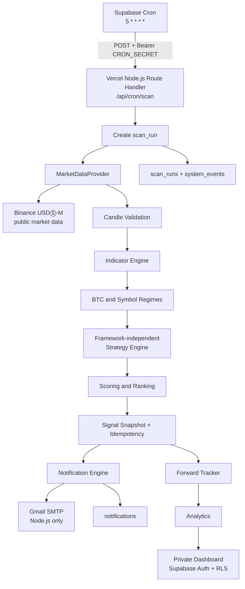

# TradePulse Architecture

Status: M0 foundation design
Runtime baseline: Node.js 22+
Deployment baseline: Next.js App Router on Vercel

## System boundary



## Responsibility split

### Next.js / Vercel

- Serves the App Router UI and private dashboard routes.
- Hosts finite-lifetime Node.js Route Handlers and Vercel Functions.
- Owns server-side orchestration, public health reporting, and the future protected scan entry point.
- Sends Gmail SMTP from Node.js only; no SMTP dependency is placed in the browser or Edge Runtime.
- Does not run a permanent worker, infinite loop, or real-trading worker.

### Supabase

- Provides PostgreSQL, Auth, RLS, Cron, and persistent operational records.
- Calls the future Vercel scan endpoint once per hour, approximately five minutes after the hourly 1H candle close (`5 * * * *`).
- Stores strategy versions, signals, scores, results, decisions, notifications, scan runs, events, and future backtest records.
- Does not contain the core strategy in triggers or PL/pgSQL. Strategy logic remains in TypeScript.

### Binance

- Is an interchangeable public market-data adapter in the future M1 implementation.
- The Strategy Engine receives normalized candles and context, never Binance URLs or SDK details.
- No private endpoint, account endpoint, API key, order endpoint, or withdrawal capability is part of the current architecture.

### Gmail

- Is a notification transport only.
- The later implementation uses `smtp.gmail.com`, port `587`, STARTTLS, and a Google App Password.
- SMTP credentials are read only by a server function and delivery state is persisted in `notifications`.

## Code boundaries

```text
src/
  app/                 App Router pages and Route Handlers
  lib/
    analytics/         Future performance queries and metric definitions
    config/            Centralized, audited application configuration
    indicators/        Future EMA/RSI/ATR/volume calculations
    market-data/       MarketDataProvider and Binance adapter boundary
    notifications/     Future email policy, template, and delivery adapter
    scoring/           Future component score and grade calculation
    security/          Auth, cron, and secret-handling helpers
    signals/           Future snapshot, idempotency, and lifecycle services
    strategy/          Single Source of Truth for future strategy rules
    supabase/          Browser and server SSR client boundaries
    types/             Shared domain types
backtest/              Future runner that imports the same Strategy Engine
supabase/migrations/   Versioned SQL schema; never Dashboard-only changes
tests/                 Unit and integration tests
docs/                  Product, architecture, strategy, security, and test design
```

M0 creates only the minimal app, configuration boundary, SSR client helpers, cron authorization helper, and health route. The domain engines above remain deliberately unimplemented until their milestones.

## Realtime scan lifecycle

The future M4 request is finite and ordered:

1. Verify `Authorization: Bearer <CRON_SECRET>` before doing work.
2. Create a `scan_runs` row with a unique scheduled run identity.
3. Request public candles for the five approved symbols and required 1H/4H history.
4. Reject missing, stale, out-of-order, malformed, or incomplete data; record `DATA_ERROR` or `SCAN_FAILED` and create no formal signal.
5. Calculate indicators and regimes in pure domain code.
6. Call the one Strategy Engine for each symbol.
7. Calculate score, grade, rank, and reference values.
8. Insert the immutable signal using the database uniqueness constraint.
9. Create notification records and await bounded SMTP delivery in the same function lifetime.
10. Persist scan outcome, notification outcome, and system events before returning the response.

No step may rely on work continuing after the function returns.

## Single Source of Truth

The Strategy Engine accepts normalized candles, indicators, and market context and returns deterministic candidates. It imports no Vercel, Supabase, Gmail, HTTP, React, or database module.

```text
Strategy Engine
├── Realtime Scanner adapter
└── Backtest Runner adapter
```

The two adapters may differ in data loading and persistence, but not in signal conditions, score inputs, reference formulas, or lifecycle semantics.

## Authentication flow

- Authenticated browser sessions use Supabase Auth cookies through `@supabase/ssr`.
- Server-rendered protected pages use a server Supabase client and validate claims according to current Supabase guidance.
- A Next.js Proxy will be added when the private dashboard is implemented; M0 does not expose a dashboard route.
- Data access is additionally enforced by Postgres RLS. Authenticated access alone is not an ownership policy.
- A cron request is machine-authenticated separately with `CRON_SECRET`; it is not treated as a browser session.

## Environment separation

| Environment | Database | Notifications | Secrets |
| --- | --- | --- | --- |
| Local | Explicitly selected development project or none | Safe mode by default | `.env.local`, never committed |
| Preview | Separate/approved development or preview project | Safe mode; no production recipient by default | Vercel Preview variables |
| Production | Explicit production project | Enabled only after smoke test and review | Vercel Production variables |

An environment name is never inferred to mean a production database. Remote migrations require an explicitly identified development or production target and a separate review.

## Failure and observability

The system follows **No Data > Bad Signal**. Every future scan must make it possible to answer whether Cron ran, the endpoint authenticated, data arrived, data was rejected, a candidate existed, a score was filtered, a signal was persisted, and an email was sent. `scan_runs`, `system_events`, `signals`, and `notifications` form the durable audit trail; Vercel runtime logs and Supabase Cron history provide transport-level evidence.

## M0 non-goals

No formal scanner endpoint, Binance adapter, indicator implementation, Strategy Engine implementation, backtest, SMTP send, dashboard auth page, production Supabase application, or Vercel deployment is created in M0.
