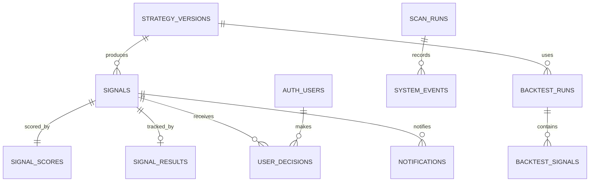

# TradePulse Database Design

Status: M0 schema design only
Migration: `supabase/migrations/20260816000000_initial_schema.sql`

## Rules

- PostgreSQL is the system of record for formal signals and their lifecycle.
- Every timestamp is `timestamptz`; PostgreSQL stores it in UTC and the UI converts it to `APP_TIMEZONE` only at the display boundary.
- Every public-schema table has RLS enabled. No table is intended for anonymous access.
- M0 creates no `real_orders`, `real_fills`, or `real_positions` table.
- Core strategy rules remain in TypeScript; the migration contains no strategy trigger or PL/pgSQL decision engine.
- M0 does not apply this migration to a remote project.

## Entity model

## Tables

### `strategy_versions`

Audited strategy identities. A signal references the version that produced it; historical signals never change when a later version is introduced.

### `signals`

The immutable formal signal snapshot. It stores symbol, direction, times, reference values, score, grade, indicator snapshot, market regimes, trigger reason, invalidation condition, and an application-created fingerprint. The composite uniqueness constraint on `(strategy_version, symbol, direction, signal_candle_time)` is the database idempotency backstop.

### `signal_scores`

The five score components and their total. The database checks the component bounds and the 100-point allocation; the approved sub-score formulas remain in the Strategy Engine.

### `signal_results`

Forward-tracking terminal state and result snapshot. It starts as `OPEN` and may become `TP`, `SL`, `TIME_EXIT`, or `INVALIDATED`.

### `user_decisions`

The user's independent manual record for a signal. Rows are owned by `user_id` and can contain `TRADED`, `SKIPPED`, `EXPIRED`, `INVALIDATED`, or `UNDECIDED`. This table does not trigger any exchange action.

### `notifications`

Durable email delivery state: signal, channel, recipient, status, attempts, last error, sent time, and timestamps. A unique signal/channel/recipient tuple prevents duplicate notification records.

### `scan_runs`

One finite scanner invocation, with schedule, lifecycle status, counts, and safe error fields. It is the operational parent for system events.

### `system_events`

Structured, non-secret operational events with timestamp, environment-independent operation, status, error code, optional scan and symbol, safe message, and JSON metadata.

### `backtest_runs`

Future backtest execution metadata and aggregate metrics. It references a strategy version and stores inputs and outputs as snapshots.

### `backtest_signals`

Future per-signal backtest output. It is separate from live `signals` so historical simulation cannot be mistaken for a live alert.

## Access model

| Data | Anonymous | Authenticated user | Server worker |
| --- | --- | --- | --- |
| Signals, scores, results | Denied | Read | Server-side write/read with approved secret client |
| User decisions | Denied | Own rows only | Server-side support as required |
| Notifications and scan status | Denied | Read | Server-side write/read |
| Strategy versions and backtest records | Denied | Read | Server-side write/read |
| System events | Denied | Read | Server-side write/read |

The migration grants only the minimum authenticated permissions and creates no anonymous policy. The future server client must never be imported into browser code.

## RLS notes

- All exposed tables enable RLS explicitly.
- `user_decisions` policies use `(select auth.uid()) = user_id` for select, insert, update, and delete.
- Update policies include both `USING` and `WITH CHECK` so an authenticated user cannot reassign ownership.
- Global system records are readable only to the authenticated role; write policies are intentionally absent for browser clients.
- RLS is defense in depth; server endpoints still authenticate requests and validate input.

## Migration workflow

1. Review the SQL file in Git.
2. Select and identify a development Supabase project explicitly.
3. Apply or validate the migration through the current Supabase CLI workflow.
4. Run database tests/advisors and inspect RLS policies.
5. Only after a separate production review may the same migration history be applied to production.

The migration file is the source of truth; manual Dashboard changes must be captured as a follow-up migration.
