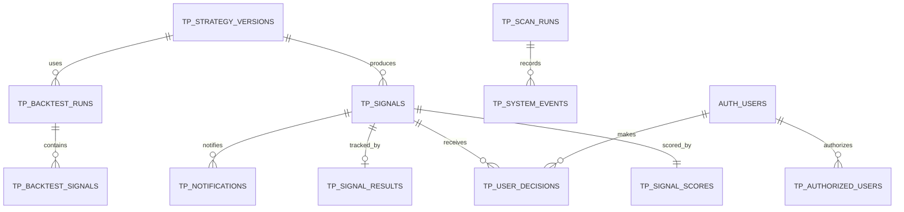

# TradePulse Database Design

Status: Production launch preparation; namespace cutover only
Migrations:

- `supabase/migrations/20260816000000_initial_schema.sql`
- `supabase/migrations/20260816010000_m0_review_remediation.sql`
- `supabase/migrations/20260823000000_signal_advisory.sql`

## Rules

- PostgreSQL is the system of record for formal signals and their lifecycle.
- Every timestamp is `timestamptz`; PostgreSQL stores it in UTC and the UI converts it to `APP_TIMEZONE` only at the display boundary.
- Every public-schema table has RLS enabled. No table is intended for anonymous access.
- `authenticated` is only the Supabase database role. It is not TradePulse authorization.
- A user must have an enabled row in `tp_authorized_users` to read any global TradePulse data.
- M0 creates no `real_orders`, `real_fills`, or `real_positions` table.
- Core strategy rules remain in TypeScript; the migration contains no strategy trigger or PL/pgSQL decision engine.
- This PR does not apply migrations to a remote project.

## Production launch target

- Supabase project ref: `jfvbikivtpfjgfsnggiz`
- Supabase URL: `https://jfvbikivtpfjgfsnggiz.supabase.co`
- `NEXT_PUBLIC_SUPABASE_URL` uses the URL above.
- `SUPABASE_SECRET_KEY` is required only in server-side Vercel environments;
  it is never committed, exposed to the browser, or printed in logs.
- The namespace cutover is designed for the shared database and does not
  modify the unrelated existing `public.signals` table.

## Entity model



## Tables

### `tp_strategy_versions`

Audited strategy identities. A signal references the version that produced it; historical signals never change when a later version is introduced.

### `tp_signals`

The immutable formal signal snapshot. It stores symbol, direction, times, reference values, score, grade, indicator snapshot, market regimes, trigger reason, invalidation condition, and an application-created fingerprint. The composite uniqueness constraint on `(strategy_version, symbol, direction, signal_candle_time)` is the database idempotency backstop.

### `tp_signal_scores`

The five score components and their total. The database checks component bounds and enforces:

```text
total_score = trend_strength
            + pullback_quality
            + breakout_strength
            + volume_score
            + risk_reward_score
```

The approved sub-score formulas remain in the Strategy Engine. `tp_signals.score` and `tp_signal_scores.total_score` are one persisted score, not two independently calculated scores. The application persistence service calculates the value once and writes both rows in one transaction; the deferred database triggers reject a missing score row or a cross-table mismatch at commit time.

### `tp_signal_results`

Forward-tracking terminal state and result snapshot. It starts as `OPEN` and may become `TP`, `SL`, `TIME_EXIT`, or `INVALIDATED`.

### `tp_user_decisions`

The user's independent manual record for a signal. Rows are owned by `user_id` and can contain `TRADED`, `SKIPPED`, `EXPIRED`, `INVALIDATED`, or `UNDECIDED`. This table does not trigger any exchange action.

### `tp_notifications`

Durable email delivery state: signal, channel, recipient, status, attempts, last error, sent time, and timestamps. A unique signal/channel/recipient tuple prevents duplicate notification records.

### `tp_scan_runs`

One planned scanner cycle, with a stable unique `run_key`, lifecycle status, counts, retry attempt count, lease expiry, and safe error fields. The key is derived from the UTC schedule cycle (for example, `hourly-1h:2026-08-16T10:00:00.000Z`), not the time at which a cron invocation happens. It is the operational parent for system events.

### `tp_system_events`

Structured, non-secret operational events with timestamp, environment-independent operation, status, error code, optional scan and symbol, safe message, and JSON metadata.

### `tp_backtest_runs`

Future backtest execution metadata and aggregate metrics. It references a strategy version and stores inputs and outputs as snapshots.

### `tp_backtest_signals`

Future per-signal backtest output. It is separate from live `signals` so historical simulation cannot be mistaken for a live alert.

### `tp_authorized_users`

The private application's explicit authorization allowlist. It supports one `OWNER` row and zero or more `AUTHORIZED` rows; both enabled access levels may read the private TradePulse data. The migration intentionally does not seed a real user ID. An owner is provisioned by an identified server-side/admin operation, for example:

```sql
insert into public.tp_authorized_users (user_id, access_level)
values ('<owner-auth-user-uuid>', 'OWNER');
```

The browser can read only its own authorization row and cannot insert, update, or delete authorization rows. Disabling or deleting the row immediately removes that user's RLS access after the session's database request is evaluated.

## Access model

| Data | Anonymous | Authenticated but not authorized | Authorized TradePulse user | Server worker |
| --- | --- | --- | --- |
| Signals, scores, results | Denied | Denied | Read | Server-side write/read with approved secret client |
| User decisions | Denied | Denied | Own rows only | Server-side support as required |
| Notifications and scan status | Denied | Denied | Read | Server-side write/read |
| Strategy versions and backtest records | Denied | Denied | Read | Server-side write/read |
| System events | Denied | Denied | Read | Server-side write/read |
| Authorization row | Denied | Denied | Own row only | Server-side/admin provisioning |

The migration grants only the minimum authenticated permissions and creates no anonymous policy. A table grant makes a table reachable by a Postgres role; the RLS policy then requires an enabled authorization row. The future server client must never be imported into browser code.

## RLS notes

- All exposed tables enable RLS explicitly.
- Global read policies use an `exists` predicate against `tp_authorized_users`, keyed by `(select auth.uid())` and `enabled = true`.
- `tp_authorized_users` itself exposes only the current user's row to `authenticated` and has no browser write policies.
- `tp_user_decisions` policies require both the explicit authorization row and `(select auth.uid()) = user_id` for select, insert, update, and delete.
- Update policies include both `USING` and `WITH CHECK` so an authenticated user cannot reassign ownership.
- Global system records are readable only to explicitly authorized TradePulse users; write policies are intentionally absent for browser clients.
- RLS is defense in depth; server endpoints still authenticate requests and validate input.

## Idempotent scan claim

The scan worker derives one `run_key` from the planned UTC cycle, then uses the unique constraint as the first claim boundary:

1. Insert the planned row with `on conflict (run_key) do nothing`.
2. Lock the existing row with `select ... for update` in the same database transaction.
3. Return without full business work when the row is `SUCCEEDED` or has an unexpired `RUNNING`/`PENDING` lease.
4. For `FAILED`, `PARTIAL`, or an expired lease, update the same row, increment `attempt_count`, set a new lease, and retry.
5. Release the lease only when the same run row reaches a terminal status.

This permits safe retries without creating a second `tp_scan_runs` row for the same planned period. The full cron/scanner implementation remains out of scope for M0.

## Migration workflow

1. Review both SQL files in Git in timestamp order.
2. Select and identify a development Supabase project explicitly.
3. Apply or validate the migration through the current Supabase CLI workflow.
4. Run database tests/advisors and inspect RLS policies.
5. Only after a separate production review may the same migration history be applied to production.

The migration file is the source of truth; manual Dashboard changes must be captured as a follow-up migration.
